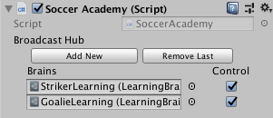
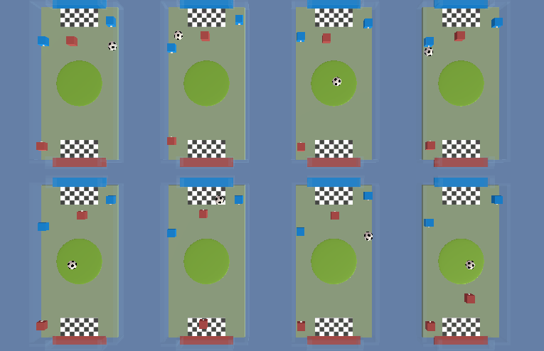

# Environment Setup
## Setup
This document is assuming that you have installed UnityHub or Unity application and have installed ml-agent library.
<br>Now, This tutorial will teach you how to build the SoccerTwo environment  which will directly interact with python api.
## Overview
There have four part to build the enviroment. 
* Setting the Academy.cs for soccer game
* build the binary file on environment. 
* gym wrapper Unity environment
* Test your environment for python

### 1. Setting the Academy
Open Editor and go to your file path (ml-agents/Example/SoccerTwos) and open the scenes. <br> 
click the Academy on left side (Fig 1)<br><br>


Find  the **Learning Brain** on right side and click the checkbox **control**.(Fig 2)<br>


This process allow you to control the agent by the Learning Brain; Also, This setup allow you to train two brain in the training not just single brain but you need to custom your enviroment.

### 2. Binary File
After setup, you need to build the binary file; you can just use the binary file path on your python script; It will popup the window and open the scene for visualization.

1. Open Player Settings (menu: **Edit** > **Project Settings** > **Player**).
2. Under **Resolution and Presentation**:
   * Ensure that **Run in Background** is Checked.
   * Ensure that **Display Resolution Dialog** is set to Disabled.
3. Open the Build Settings window (menu:**File** > **Build Settings**).
4. Choose your target platform.
   * (optional) Select “Development Build” to [log debug
      messages](https://docs.unity3d.com/Manual/LogFiles.html).
5. If any scenes are shown in the **Scenes in Build** list, make sure that the
   3DBall Scene is the only one checked. (If the list is empty, then only the
   current scene is included in the build).
6. Click **Build**:
   * In the File dialog, navigate to your ML-Agents directory.
   * Assign a file name and click **Save**.
   * (For Windows）With Unity 2018.1, it will ask you to select a folder instead
     of a file name. Create a subfolder within the ML-Agents folder and select
     that folder to build. In the following steps you will refer to this
     subfolder's name as `env_name`

### 3. Unity ML-Agents Gym Wrapper

A common way in which machine learning researchers interact with simulation
environments is via a wrapper provided by OpenAI called `gym`. For more
information on the gym interface, see [here](https://github.com/openai/gym).

Unity provide a gym wrapper and instructions for using it with existing machine
learning algorithms which utilize gyms. Both wrappers provide interfaces on top
of their `UnityEnvironment` class, which is the default way of interfacing with a
Unity environment via Python.

### Installation

The gym wrapper can be installed using:

```sh
pip install gym_unity
```

or by running the following from the `/gym-unity` directory of the repository:

```sh
pip install .
```

### Using the Gym Wrapper

The gym interface is available from `gym_unity.envs`. To launch an environment
from the root of the project repository use:

```python
from gym_unity.envs import UnityEnv

env = UnityEnv(environment_filename, worker_id, use_visual, uint8_visual, multiagent)
```

*  `environment_filename` refers to the path to the Unity environment.

*  `worker_id` refers to the port to use for communication with the environment.
   Defaults to `0`.

*  `use_visual` refers to whether to use visual observations (True) or vector
   observations (False) as the default observation provided by the `reset` and
   `step` functions. Defaults to `False`.

*  `uint8_visual` refers to whether to output visual observations as `uint8` values 
   (0-255). Many common Gym environments (e.g. Atari) do this. By default they 
   will be floats (0.0-1.0). Defaults to `False`.

*  `multiagent` refers to whether you intent to launch an environment which
   contains more than one agent. Defaults to `False`.

*  `flatten_branched` will flatten a branched discrete action space into a Gym Discrete. 
   Otherwise, it will be converted into a MultiDiscrete. Defaults to `False`.

The returned environment `env` will function as a gym.

### Limitation

* It is only possible to use an environment with a single Brain.
* By default the first visual observation is provided as the `observation`, if
  present. Otherwise vector observations are provided.
* All `BrainInfo` output from the environment can still be accessed from the
  `info` provided by `env.step(action)`.
* Stacked vector observations are not supported.
* Environment registration for use with `gym.make()` is currently not supported.

### 4. Test on python api
After you complete all above setup,
you can use a python api to interact with SoccerTwo Environment.
you also can see ```env.py``` to check detail about that.
Remember your binary file path to replace my binary file path in ```env.py```


### Appendix
The Soccer Environment knowledge... 

### Action Space
#### striker :
length: 7 <br>
each one dimension: <br>
[0] : not move <br>
[1] : forward <br>
[2] : backward <br>
[3] : rotate Clockwise <br>
[4] : rotate Counterclockwise <br>
[5] : left shift <br>
[6] : right shift <br>

#### goalie :
length :5 <br>
each one dimension: <br>
[0]: not move <br>
[1]: forward <br>
[2]: backward <br>
[3]: left shift <br>
[4]: right shift <br>

### Observation Space
each striker and each goalie will have 112 dimension vector represent their observations. <br>

### Two Goal:

striker: Get the ball into the opponent's goal.
goalie : Prevent the ball from entering its own goal.

### Index:

 <br>
from left up to right down, the indexes of red agents are 0 - 7. <br>
from left up to right down, the indexes of blue agents are  8 -16. <br>


